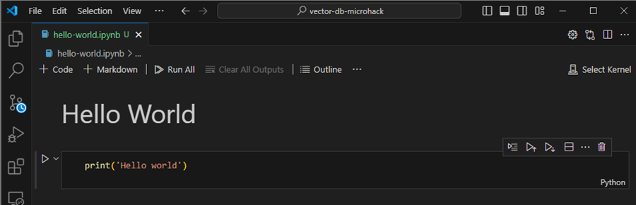
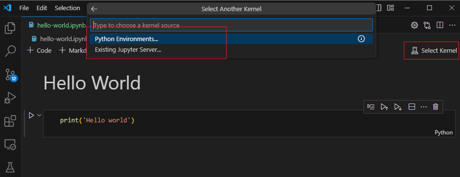
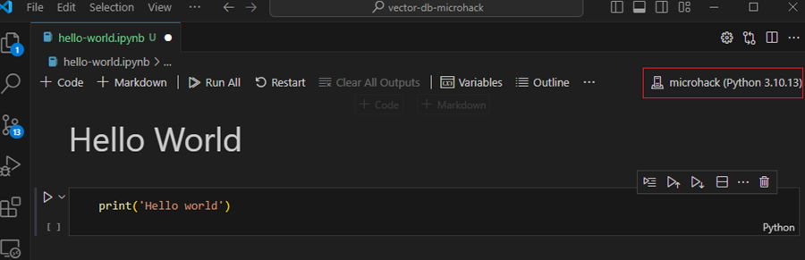
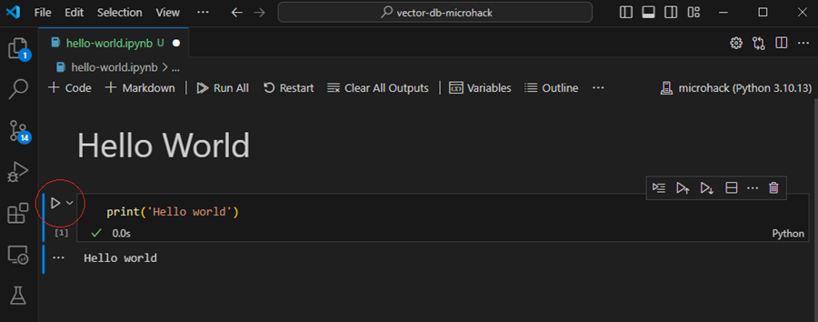

# Vector DB Microhack

## Set up conda environment

Follow the steps -

- Download and install miniconda from this link - https://docs.anaconda.com/free/miniconda/

- Open command prompt and run the following command

       C:\>conda update conda

- Clone this repository to your machine.

- Create a conda environment from the microhack_conda.yml file.
        
      C:\vector-db-microhack>conda env create -f microhack_conda.yml

- Open the hello_world.ipynb in VS Code.

- Using the Kernel selector, select the microhack conda environment.

- Execute the hellow world cell using the arrow.

