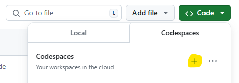
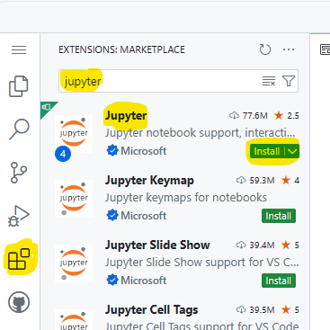

## Using Github Codespaces

1. Ensure you are logged into Github with your Github account.

2. Fork this repo. 

3. In your fork, select "Code > Codespaces > +" to create a codespace.

4. Install the Jupyter extension, by going to "Extensions" icon on the upper left side. Search for Jupyter, and select "Install".

5. Follow the remaining instructions in the [README.md](README.md) but skip step 1 (no need to download miniconda).